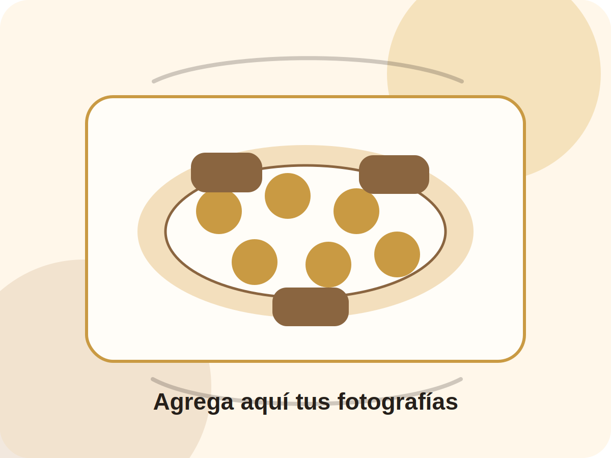

# Banquetería Artesanal

Landing page completa tipo catálogo/cotización para un emprendimiento de banquetería. Está construida con HTML, CSS y JavaScript vanilla, sin frameworks ni librerías externas.

## Archivos del proyecto

- `index.html`: estructura de la landing page, secciones, menú y datos de contacto.
- `styles.css`: estilos, paleta de colores, responsive y componentes visuales.
- `script.js`: productos, filtros, menú hamburguesa y enlaces de WhatsApp.
- `img/placeholder.svg`: imagen placeholder para reemplazar por fotografías reales.

## Cómo usar

Abre `index.html` directamente en el navegador o publica estos archivos en cualquier hosting estático.

## Editar WhatsApp

En `script.js`, cambia la constante:

```js
const WHATSAPP_NUMBER = "56954452333";
```

Usa el formato internacional sin `+`, espacios ni guiones. Ejemplo para Chile:

```js
const WHATSAPP_NUMBER = "56954452333";
```

Los enlaces se generan desde la función reutilizable:

```js
function buildWhatsAppUrl(message) {
  return `https://wa.me/${WHATSAPP_NUMBER}?text=${encodeURIComponent(message)}`;
}
```

También puedes editar el mensaje general en `script.js` dentro de la configuración de enlaces de WhatsApp.

## Editar productos

Los productos están en el arreglo `products` dentro de `script.js`. Cada producto puede tener:

- `name`: nombre del producto.
- `price`: precio visible.
- `presentation`: presentación opcional, por ejemplo `50 unidades` o `A pedido`.
- `category`: `Salados` o `Dulces`.
- `tags`: filtros asociados (`salados`, `dulces`, `unidad`, `packs`, `pedido`).
- `description`: descripción del producto.
- `icon`: emoji usado como visual temporal.

Ejemplo:

```js
{ name: 'Tapaditos', price: '$480 c/u', category: 'Salados', tags: ['salados', 'unidad'], description: 'Pequeños sándwiches ideales para cócteles, reuniones y celebraciones.', icon: '🥪' }
```

## Editar colores

La paleta está al inicio de `styles.css` en `:root`:

```css
:root {
  --cream: #fff7ea;
  --gold: #c99a43;
  --coffee: #8a6540;
  --black-soft: #251f1a;
}
```

Cambia estos valores para adaptar la identidad visual.

## Editar imágenes

La web usa `img/placeholder.svg` en el hero y fondos visuales elegantes en las tarjetas. Para agregar fotos reales:

1. Guarda las imágenes dentro de la carpeta `img`.
2. Reemplaza la ruta del hero en `index.html`:

```html

```

3. Si quieres fotos por producto, agrega una propiedad `image` a cada producto en `script.js` y ajusta el renderizado de `.product-visual`.

## Secciones incluidas

- Header responsive con menú hamburguesa.
- Hero con llamadas a la acción.
- Catálogo con filtros funcionales.
- Packs sugeridos sin precios inventados.
- Pasos para cotizar.
- Sección de confianza.
- Contacto editable.
- Footer y botón flotante de WhatsApp.
